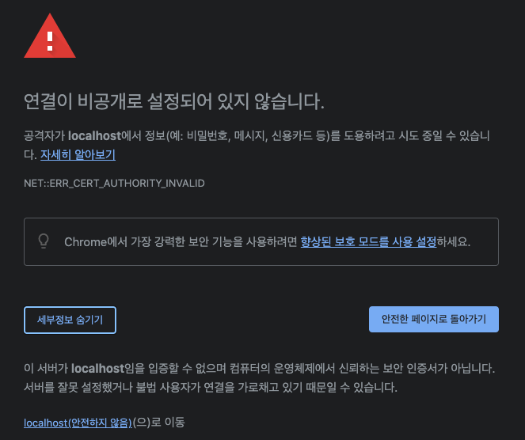

# :back: Backend

## local 개발 방법

### :key: client-secret 적용
client-secret 적용 방법에는 2가지가 있다.

- IDE VM argument 설정

  1. run -> Run Configurations

  2. Spring Boot App -> mafia -> Arguments -> VM arguments에 아래와 같이 작성 -> Apply

     ```
     -Dspring.security.oauth2.client.registration.google.client-secret=<GOOLE_CLIENT_SECRET>
     ```

     


- 환경 변수 설정
`GOOGLE_CLIENT_SECRET`으로 환경 변수를 설정하면 된다


### 환경 구축

- DB
local에서는 mysql 또는 mariadb를 사용하면 되고, schema는 `mafia` 이름으로 생성해주면 된다.


- openvidu
[run-environment-for-backend.sh](../script/run-environment-for-backend.sh)을 통해 openvidu docker container를 실행하면 된다.

- redis
  - 설치 및 실행
  [run-environment-for-backend.sh](../script/run-environment-for-backend.sh)을 통해 redis docker container를 실행하면 된다.

  - redis-cli 사용 방법
  [run-redis-cli.sh](../script/run-redis-cli.sh)을 통해 redis container의 redis-cli를 실행할 수 있다.

  - redis-cli 명령어

    ```sh
    keys * # 모든 key 조회
    hgetall "GameSession:V1234" # GameSession V1234의 모든 field 조회
    hget "GameSession:V1234" hostId # GameSession V1234의 hostId field 조회
    del "GameSession:V1234:idx" # GameSession V1234의 idx 제거 (단, 해당 key만 제거)
    flushall # 모든 key 제거
    ```


## STOMP local 테스트 방법
- <https://jxy.me/websocket-debug-tool/>에 접속한다
- 이미지와 같이 connect header에 'playerId' 항목을 입력하고 'Connect' 버튼을 누른다

- 설정되어 있는 subscribe destination('/sub')에 맞게 subscribe를 한다
- 설정되어 있는 send destination('/pub')에 맞게 Send를 한다

## known error
### 방에 입장했을 때 openvidu session 연결이 안 되는 경우
openvidu 서버가 self signed 인증으로 되어 있기 때문에 broswer 입장에서 openvidu 서버의 주소가 안전하지 않다고 판단하여 접근을 막는다.  
따라서, openvidu 서버의 주소인 https://localhost:4443/dashboard에 browser로 접속하여 다음과 같은 경고가 뜨더라도 계속 진행한다.



다음과 같이 'Test' 버튼을 클릭한다.


Openvidu의 secret key를 입력한다(default값은 보통 `MY_SECRET` 이다).


